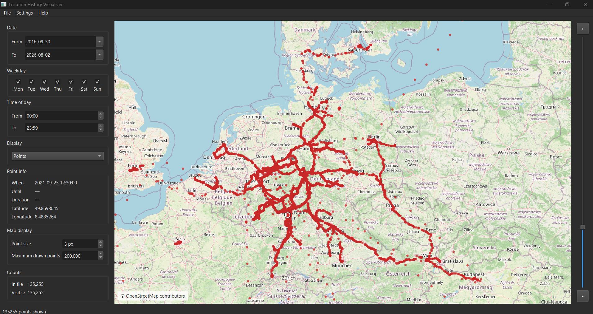

# Location History Visualizer

Native **C++20 / Qt 6** desktop app that plots a [Google Timeline](https://timeline.google.com/) JSON export on [OpenStreetMap](https://www.openstreetmap.org/) raster tiles. Parsing, filters, and overlay math run locally; the map only fetches OSM tiles.



Version **1.0.0.R**. Author [ViezTrinker](https://github.com/ViezTrinker). Release notes: [CHANGELOG.md](CHANGELOG.md).

## Features

- **Google Timeline JSON** — current export (`semanticSegments` path/visits and `rawSignals.position`), not the old `locations[]` E7 format
- **OpenStreetMap map** — pan, mouse-wheel and double-click zoom, zoom slider beside the map, OSM attribution
- **Filters** — date range, weekdays, time of day
- **Display modes** — Points (simple red dots of the filtered data), Cluster, and Story
- **Story view** — starts on a chosen day as red points; Play continues through all following days
- **Point info** — click a point for local time, stay duration (visits), latitude, and longitude
- **Smart start view** — after load, the map focuses on the densest area, not the bounding-box center
- **Languages** — Settings → Language: English (default), German, Spanish, French, Russian, Arabic, Italian, Turkish, Dutch, Portuguese, Polish. Arabic uses a right-to-left layout
- **Theme** — Settings → Theme: dark (default) or light; the choice is remembered
- **Map display** — Settings → Map display: point size and a drawn-point cap (default 20 000); both are remembered
- **Point counts** — the sidebar shows how many samples the JSON contains and how many are currently visible
- **Local-first** — your JSON stays on disk; OSM tile requests reveal only the current map viewport

## Architecture

Layers, data flow, and module notes: [doc/README.md](doc/README.md).

## Dependencies

These are **not** all in the Git repo:

| Dependency | How it is obtained |
| --- | --- |
| **Qt 6** (Widgets, Network, LinguistTools) | You install it. Too large and compiler-specific to vendor. |
| **nlohmann/json** | CMake FetchContent (needs network on first configure). |
| **GoogleTest** | Git submodule `third_party/googletest`. |

## Clone

```text
git clone --recurse-submodules https://github.com/ViezTrinker/location-history-visualizer.git
```

If you already cloned without submodules:

```text
git submodule update --init --recursive
```

## Install Qt 6

Official installer: <https://www.qt.io/download-qt-installer>

Select a **Qt 6.x MSVC 64-bit** kit, for example `msvc2022_64`. LinguistTools ships with that kit (needed to compile UI translations).

Or from a terminal:

```text
python -m pip install aqtinstall
python -m aqt install-qt windows desktop 6.8.3 win64_msvc2022_64 --outputdir C:/Qt
```

If CMake cannot find Qt, pass the kit directory:

```text
cmake -B build -G "Visual Studio 18 2026" -A x64 -DCMAKE_PREFIX_PATH=C:/Qt/6.8.3/msvc2022_64
cmake --build build --config Release
```

On Windows, CMake also looks under `C:/Qt/6.*/msvc*_64` automatically.

For a machine-specific Visual Studio preset, copy `CMakeUserPresets.json.example` to `CMakeUserPresets.json` and edit the Qt path. That file is gitignored.

In Visual Studio (Open Folder) the top dropdown lists CMake **presets**, not the classic Debug/Release box. Choose **Release** (`vs-x64-release`) there, then build. If the list is stale: Project → Delete Cache and Reconfigure.

The Release executable is `build/Release/location_history_visualizer.exe`.

## Tests

```text
cmake --build build --config Release --target location_history_visualizer_tests
.\build\Release\location_history_visualizer_tests.exe
```

Or `ctest -C Release` from the `build` folder. Details: [doc/testing.md](doc/testing.md).

## License

This project is licensed under the [MIT License](LICENSE).

Third-party components keep their own licenses (Qt, nlohmann/json, GoogleTest, OpenStreetMap tiles). Map tiles are © OpenStreetMap contributors; follow the [OSM tile usage policy](https://operations.osmfoundation.org/policies/tiles/).
