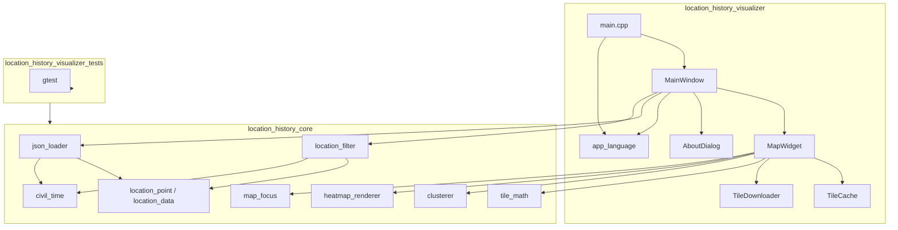
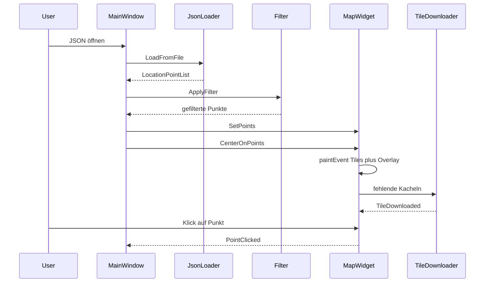

# Architektur

Der Visualizer ist eine native Windows-Desktopanwendung in C++20. Die GUI sitzt auf Qt 6, die Karte besteht aus OpenStreetMap-Rasterkacheln plus selbst gezeichnetem Overlay.

Alles fachliche liegt im Namespace `LocationHistory`. `src/main.cpp` startet nur `QApplication` und `MainWindow`.

## Schichten

CMake teilt den Code in drei Targets. Die Kernbibliothek kennt Qt nicht. Die Tests linken nur den Kern.



| Target | Rolle | Qt |
| --- | --- | --- |
| `location_history_core` | Statische Bibliothek: Parse, Filter, Projektion, Visualisierungsmathe | nein |
| `location_history_visualizer` | `.exe`: Fenster, Kacheln, Zeichnen | Widgets + Network |
| `location_history_visualizer_tests` | gtest gegen den Kern | nein |

## Laufzeitfluss



1. Datei laden → flache Punktliste (`LocationPoint`).
2. Filter (Datum, Wochentag, Uhrzeit) erzeugen `_filteredPoints`.
3. `MapWidget` zentriert auf die dichteste Zelle (`ComputeDensestFocus`) und zeichnet OSM-Kacheln plus Overlay je `DisplayMode`.
4. Klick trifft den nächsten Punkt im Pixelradius und füllt die Punktinfo.

Details: [core.md](core.md), [map.md](map.md), [ui.md](ui.md).

## Verzeichnislayout

```text
src/           Kern + Qt-UI
tests/         gtest, Fixture sample_timeline.json
third_party/   googletest (Git-Submodul)
doc/           diese Dokumentation
```

Abhängigkeiten außerhalb des Repos: Qt 6. nlohmann/json kommt per FetchContent, gtest per Submodul. Siehe Root-[README.md](../README.md).
