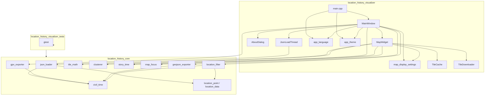
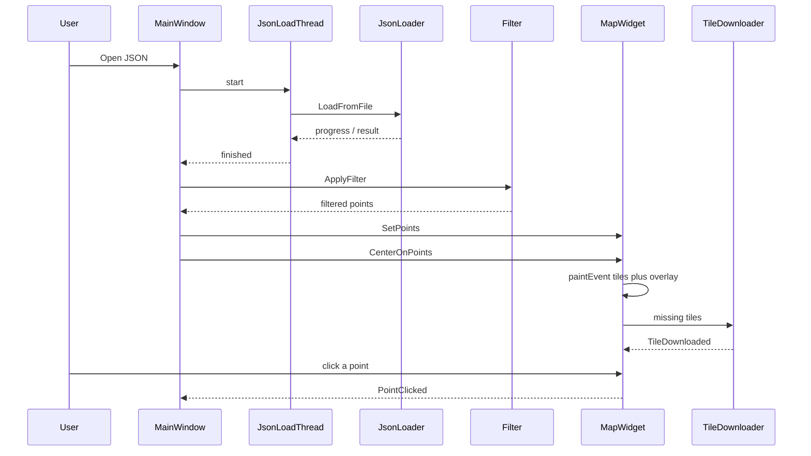

# Architecture

The visualizer is a native Windows desktop app in C++20. The GUI sits on Qt 6. The map is OpenStreetMap raster tiles plus a self-drawn overlay.

All domain code lives in the `LocationHistory` namespace. `src/main.cpp` only starts `QApplication` and `MainWindow`.

## Layers

CMake splits the code into three targets. The core library does not use Qt. The tests link only the core.



| Target | Role | Qt |
| --- | --- | --- |
| `location_history_core` | Static library: parse, filter, projection, visualization math | no |
| `location_history_visualizer` | `.exe`: window, tiles, drawing | Widgets + Network |
| `location_history_visualizer_tests` | gtest against the core | no |

## Runtime flow



1. Load a file on a worker thread → flat point list (`LocationPoint`). The UI shows progress and can cancel.
2. Filters (date, weekday, time of day) produce `_filteredPoints`.
3. `MapWidget` centers on the densest cell (`ComputeDensestFocus`) and draws OSM tiles plus the overlay for the current `DisplayMode`.
4. A click hits the nearest point within the pixel radius and fills the point-info panel.

Details: [core.md](core.md), [map.md](map.md), [ui.md](ui.md).

## Directory layout

```text
src/           entry point (main.cpp)
src/core/      Qt-free library (parse, filter, export, overlay math)
src/ui/        Qt window, settings, load thread
src/map/       MapWidget and OSM tile cache/downloader
tests/         gtest, fixture sample_timeline.json
third_party/   googletest (Git submodule)
doc/           this documentation
```

Dependencies outside the repo: Qt 6. nlohmann/json comes via FetchContent, gtest via submodule. See the root [README.md](../README.md).
