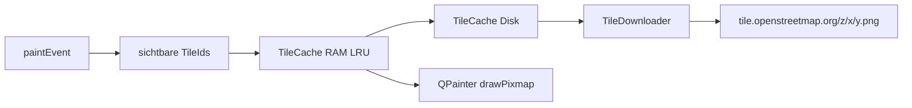

# Karte und Overlay

Die Karte ist kein Google-Maps-Widget. `MapWidget` rechnet selbst Web Mercator, holt OSM-PNGs und zeichnet Standorte darüber.

## Projektion

[`src/tile_math.h`](../src/tile_math.h) setzt geografische Koordinaten in Weltpixel um, identisch zu OSM:

- Kachelgröße 256 px
- Zoom 2..19
- Latitude auf ±85.05112878° begrenzt (Mercator-Pol)

`MapWidget` speichert die Ansicht als `_centerWorldX` / `_centerWorldY` plus `_zoom`. Mausrad und Doppelklick zoomen um den Cursor (Weltkoordinaten skalieren mit `2^(newZoom-oldZoom)`). Die Zoom-Leiste in `MainWindow` (`+` / Slider / `-`) zoomt um die Kartenmitte und bleibt über `ZoomChanged` synchron. Ziehen verschiebt das Zentrum in Pixeln.

Nach dem Laden zentriert `CenterOnPoints` auf die dichteste Zelle, nicht auf die Bounding-Box. Die Berechnung liegt in [`src/map_focus.h`](../src/map_focus.h) (`ComputeDensestFocus`, Raster ~0.02°).

## Kachel-Pipeline

[`src/tile_cache.h`](../src/tile_cache.h): bis `MaxMemoryTiles` (256) im RAM, LRU-Eviction. Disk unter `%LOCALAPPDATA%/<AppName>/tiles/{z}/{x}/{y}.png`.

[`src/tile_downloader.h`](../src/tile_downloader.h): `QNetworkAccessManager`, maximal **2** parallele Requests (OSM Tile Policy), fester User-Agent. Queue plus In-Flight-Set verhindern Doppel-Downloads. Fertige PNGs gehen per Signal `TileDownloaded` an `MapWidget`, das Cache schreibt und `update()` auslöst.

Fehlende Kacheln erscheinen grau, bis der Download kommt. Unten links: `© OpenStreetMap contributors`.

## Overlay-Modi

[`src/map_widget.h`](../src/map_widget.h) zeichnet in `paintEvent` zuerst Tiles, dann je `DisplayMode`:

| Modus | Verhalten |
| --- | --- |
| `AllPoints` | Kreise, Viewport-Culling, bei mehr als `MaxDrawnPoints` (20000) Downsampling |
| `Clustered` | `BuildClusters` am aktuellen Zoom, Kreisgröße ~ log(count) |
| `Heatmap` | Punkte ins Raster (`AddHeatSample`), Downsample 4×, ein `GaussianBlur`, Color-Ramp |
| `Blur` | wie Heatmap, anderer Blur-Radius |

Heatmap/Blur cachen den Intensitätsbuffer (`_cachedHeatIntensity`) und bauen ihn nur neu bei Zoom, Pan, Punkten oder Größe. Normalisierung über `ScaledHeatCeiling(MaxHeat, _heatScale)`. Der Skalierungsregler in der UI hebt schwache Intensitäten an; häufige Orte sättigen früher.

## Trefferprüfung

Linksklick ohne nennenswerten Drag: nächster Punkt innerhalb `HitTestRadiusPx` (12). Signal `PointClicked(lat, lng, unixTimeMs, utcOffsetMinutes)` bzw. `PointCleared`. Der gewählte Punkt bekommt einen Ring im Punkte-Modus.
