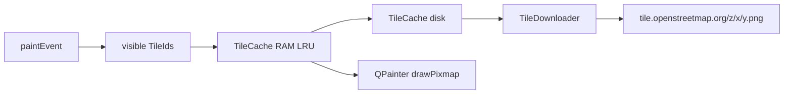

# Map and overlay

The map is not a Google Maps widget. `MapWidget` computes Web Mercator itself, fetches OSM PNGs, and draws locations on top.

## Projection

[`src/tile_math.h`](../src/tile_math.h) converts geographic coordinates to world pixels, matching OSM:

- Tile size 256 px
- Zoom 2..19
- Latitude clamped to ±85.05112878° (Mercator pole)

`MapWidget` stores the view as `_centerWorldX` / `_centerWorldY` plus `_zoom`. Mouse wheel and double-click zoom around the cursor (world coordinates scale by `2^(newZoom-oldZoom)`). The zoom bar in `MainWindow` (`+` / slider / `-`) zooms around the map center and stays in sync via `ZoomChanged`. Dragging shifts the center in pixels.

After load, `CenterOnPoints` focuses on the densest cell, not the bounding box. The calculation lives in [`src/map_focus.h`](../src/map_focus.h) (`ComputeDensestFocus`, grid ~0.02°).

## Tile pipeline

[`src/tile_cache.h`](../src/tile_cache.h): up to `MaxMemoryTiles` (256) in RAM, LRU eviction. Disk under `%LOCALAPPDATA%/<AppName>/tiles/{z}/{x}/{y}.png`.

[`src/tile_downloader.h`](../src/tile_downloader.h): `QNetworkAccessManager`, at most **2** parallel requests (OSM tile policy), fixed User-Agent. A queue plus an in-flight set prevent duplicate downloads. Finished PNGs go to `MapWidget` via the `TileDownloaded` signal, which writes the cache and calls `update()`.

Missing tiles appear gray until the download arrives. Bottom left: `© OpenStreetMap contributors`.

## Overlay modes

[`src/map_widget.h`](../src/map_widget.h) draws tiles first in `paintEvent`, then the current `DisplayMode`. The time cutoff (`SetUntilTime`) applies only in `Story`.

| Mode | Behavior |
| --- | --- |
| `Points` | simple red circles, viewport culling. Point size and drawn-point cap come from the sidebar (Map display; default 4 px and 20 000) |
| `Clustered` | `BuildClusters` at the current zoom, circle size ~ log(count) |
| `Story` | red points as in `Points` (same size and cap), but timed: first the start day, then all later days while Play is running |

## Hit testing

Left-click without a meaningful drag: nearest visible point within `HitTestRadiusPx` (12); visits are slightly larger. Signal `PointClicked(lat, lng, unixTimeMs, utcOffsetMinutes, endUnixTimeMs, source)` or `PointCleared`. The selected point gets a ring.
