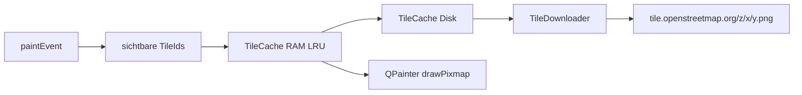

# Karte und Overlay

Die Karte ist kein Google-Maps-Widget. `MapWidget` rechnet selbst Web Mercator, holt OSM-PNGs und zeichnet Standorte darüber.

## Projektion

[`src/tile_math.h`](../src/tile_math.h) setzt geografische Koordinaten in Weltpixel um, identisch zu OSM:

- Kachelgröße 256 px
- Zoom 2..19
- Latitude auf ±85.05112878° begrenzt (Mercator-Pol)

`MapWidget` speichert die Ansicht als `_centerWorldX` / `_centerWorldY` plus `_zoom`. Mausrad und Doppelklick zoomen um den Cursor (Weltkoordinaten skalieren mit `2^(newZoom-oldZoom)`). Die Zoom-Leiste in `MainWindow` (`+` / Slider / `-`) zoomt um die Kartenmitte und bleibt über `ZoomChanged` synchron. Ziehen verschiebt das Zentrum in Pixeln.

Nach dem Laden zentriert `CenterOnPoints` auf die dichteste Zelle, nicht auf die Bounding-Box. Die Berechnung liegt in [`src/map_focus.h`](../src/map_focus.h) (`ComputeDensestFocus`, Raster ~0.02°).

## Kachel-Pipeline

[`src/tile_cache.h`](../src/tile_cache.h): bis `MaxMemoryTiles` (256) im RAM, LRU-Eviction. Disk unter `%LOCALAPPDATA%/<AppName>/tiles/{z}/{x}/{y}.png`.

[`src/tile_downloader.h`](../src/tile_downloader.h): `QNetworkAccessManager`, maximal **2** parallele Requests (OSM Tile Policy), fester User-Agent. Queue plus In-Flight-Set verhindern Doppel-Downloads. Fertige PNGs gehen per Signal `TileDownloaded` an `MapWidget`, das Cache schreibt und `update()` auslöst.

Fehlende Kacheln erscheinen grau, bis der Download kommt. Unten links: `© OpenStreetMap contributors`.

## Overlay-Modi

[`src/map_widget.h`](../src/map_widget.h) zeichnet in `paintEvent` zuerst Tiles, dann je `DisplayMode`. Der Zeit-Cutoff (`SetUntilTime`) gilt nur in `Story`.

| Modus | Verhalten |
| --- | --- |
| `Points` | einfache rote Kreise, Viewport-Culling. Punktgröße und gezeichnete Obergrenze kommen aus Settings → Map display (Default 4 px bzw. 20 000) |
| `Clustered` | `BuildClusters` am aktuellen Zoom, Kreisgröße ~ log(count) |
| `Story` | rote Punkte wie in `Points` (gleiche Größe und Obergrenze), aber zeitlich: zuerst der Starttag, mit Play alle folgenden Tage |

## Trefferprüfung

Linksklick ohne nennenswerten Drag: nächster sichtbarer Punkt innerhalb `HitTestRadiusPx` (12), Visits etwas größer. Signal `PointClicked(lat, lng, unixTimeMs, utcOffsetMinutes, endUnixTimeMs, source)` bzw. `PointCleared`. Der gewählte Punkt bekommt einen Ring.
