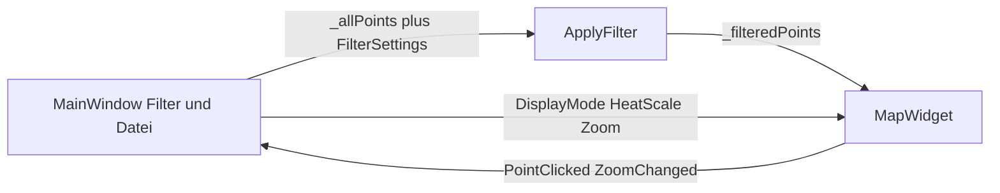

# Benutzeroberfläche

Die UI ist Qt 6 Widgets. Verbindungen laufen über Member-Slots, ohne Lambdas.

## MainWindow

[`src/main_window.h`](../src/main_window.h) hält zwei Punktlisten:

- `_allPoints` — Ergebnis von `LoadFromFile`
- `_filteredPoints` — nach `ApplyFilter`

Layout: linke Leiste (~280 px) + `MapWidget` + Zoom-Leiste rechts neben der Karte.

| Bereich | Steuerung |
| --- | --- |
| Datei | Button / Menü Datei → Öffnen, `QFileDialog` für `*.json`. Letzter Pfad in `QSettings` (`lastJsonPath`) |
| Datum | `QDateEdit` von/bis, nach dem Laden auf Min/Max der Daten gesetzt |
| Wochentag | sieben Checkboxen, Bits in `weekdayMask` |
| Uhrzeit | `QTimeEdit` 00:00–23:59 |
| Darstellung | ComboBox `DisplayMode` |
| Skalierung | `QSlider`, nur bei Heatmap und Blur aktiv, Faktor ×1..×100 logarithmisch |
| Zoom | `+`, vertikaler `QSlider` (Zoom 2..19), `-` — außerhalb der Karte |
| Punktinfo | Wann, Latitude, Longitude |

`OnOpenClicked` setzt Wait-Cursor, lädt synchron, zeigt `LoadResult` als MessageBox bei Fehler, zentriert die Karte auf die dichteste Zelle (`CenterOnPoints`).

Menü **Hilfe → About** öffnet [`src/about_dialog.h`](../src/about_dialog.h): Version `1.0.0.R`, Datum, Link ViezTrinker, Repo [location-history-visualizer](https://github.com/ViezTrinker/location-history-visualizer). Texte und URLs stehen in [`src/version.h`](../src/version.h). Links sind `QLabel` mit `setOpenExternalLinks`.

## Einstieg

[`src/main.cpp`](../src/main.cpp) setzt `applicationName` / `organizationName` aus denselben Version-Strings. Davon hängt der Tile-Cache-Pfad über `QStandardPaths::AppLocalDataLocation` ab.

## Zuständigkeiten

`MainWindow` orchestriert. Zeichnen und Kacheln bleiben in `MapWidget`. Zoom-Logik (`SetZoomAround`, Mausrad, Doppelklick) ebenfalls dort; die Zoom-Leiste gehört zu `MainWindow` und folgt über `ZoomChanged`. Parse/Filter bleiben in der Kernbibliothek.
