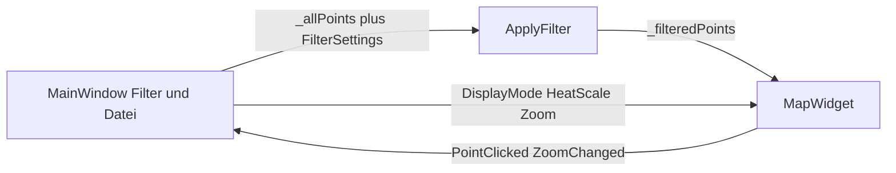

# Benutzeroberfläche

Die UI ist Qt 6 Widgets. Verbindungen laufen über Member-Slots, ohne Lambdas.

## MainWindow

[`src/main_window.h`](../src/main_window.h) hält zwei Punktlisten:

- `_allPoints` — Ergebnis von `LoadFromFile`
- `_filteredPoints` — nach `ApplyFilter`

Layout: linke Leiste (~280 px) + `MapWidget` + Zoom-Leiste rechts neben der Karte.

| Bereich | Steuerung |
| --- | --- |
| File | Button / File → Open, `QFileDialog` for `*.json`. Last path in `QSettings` (`lastJsonPath`) |
| Date | `QDateEdit` from/to, set to min/max of the data after load |
| Weekday | seven checkboxes, bits in `weekdayMask` |
| Time of day | `QTimeEdit` 00:00–23:59 |
| Display | ComboBox `DisplayMode` |
| Scaling | `QSlider`, enabled only for Heatmap and Blur, factor ×1..×100 logarithmic |
| Zoom | `+`, vertical `QSlider` (zoom 2..19), `-` — beside the map |
| Point info | When, Latitude, Longitude |
| Language | ComboBox: English (default), Deutsch, Español, Français. Stored in `QSettings` (`language`) |

Source UI strings are English. Translations live in [`translations/`](../translations/) (`.ts` → `.qm` via Qt LinguistTools). Changing the language updates the window immediately.

`OnOpenClicked` sets a wait cursor, loads synchronously, shows `LoadResult` as a message box on error, and centers the map on the densest cell (`CenterOnPoints`).

Menu **Help → About** opens [`src/about_dialog.h`](../src/about_dialog.h): version `1.0.0.R`, date, ViezTrinker link, repo [location-history-visualizer](https://github.com/ViezTrinker/location-history-visualizer). Strings and URLs come from [`src/version.h`](../src/version.h). Links are `QLabel` with `setOpenExternalLinks`.

## Einstieg

[`src/main.cpp`](../src/main.cpp) setzt `applicationName` / `organizationName` aus denselben Version-Strings. Davon hängt der Tile-Cache-Pfad über `QStandardPaths::AppLocalDataLocation` ab.

## Zuständigkeiten

`MainWindow` orchestriert. Zeichnen und Kacheln bleiben in `MapWidget`. Zoom-Logik (`SetZoomAround`, Mausrad, Doppelklick) ebenfalls dort; die Zoom-Leiste gehört zu `MainWindow` und folgt über `ZoomChanged`. Parse/Filter bleiben in der Kernbibliothek.
