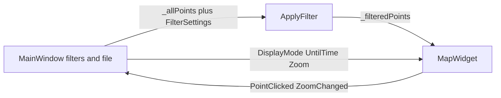

# User interface

The UI is Qt 6 Widgets. Connections use member slots, not lambdas.

## MainWindow

[`src/main_window.h`](../src/main_window.h) holds two point lists:

- `_allPoints` — result of `LoadFromFile`
- `_filteredPoints` — after `ApplyFilter`

[`src/main.cpp`](../src/main.cpp) shows the window (`show()`). Size, position, and maximized state come from `QSettings` (`windowGeometry`) via `saveGeometry` / `restoreGeometry`. First launch uses 1280×800.

Menu bar: **File | Settings | Help**. Layout below: left sidebar (~280 px) + `MapWidget` + zoom bar to the right of the map + time scrubber underneath.

| Area | Controls |
| --- | --- |
| File | Menu → Open, `QFileDialog` for `*.json`. Last path in `QSettings` (`lastJsonPath`). Load runs in the background with a progress dialog and Cancel. Exit closes the window. |
| Settings | **Language** submenu: exclusive checkable actions with native names (English, Deutsch, Español, Français, Русский, العربية, Italiano, Türkçe, Nederlands, Português, Polski, 日本語, 한국어, Bahasa Indonesia, Tiếng Việt, हिन्दी). Stored in `QSettings` (`language`). Arabic sets `Qt::RightToLeft`. **Theme** submenu: Dark (default), Light, Midnight, Nord, Sepia. Stored in `QSettings` (`theme`). Fusion palettes, independent of the Windows color mode. |
| Help | About |
| Date | `QDateEdit` from/to, set to min/max of the data after load |
| Weekday | seven columns: checkbox without text, weekday abbreviation as a label underneath. Bits in `weekdayMask` |
| Time of day | `QTimeEdit` 00:00–23:59 |
| Display | ComboBox `DisplayMode`: Points, Cluster (click a circle to zoom into that cell), or Story |
| Zoom | `+`, vertical `QSlider` (zoom 2..19), `-` — beside the map |
| Story | Visible only in Story mode: start-day picker, Play/Pause, scrubber — Play continues through later days as red points |
| Point info | When, Until, Duration, Latitude, Longitude |
| Map display | Between Point info and Counts. Point radius 1–16 px (default 4) and maximum drawn points 1000–1 000 000 (default 20 000). Applied immediately. Stored in `QSettings` (`pointRadiusPx`, `drawnPointLimit`). |
| Counts | At the bottom of the sidebar. **In file**: `_allPoints.size()`. **Visible**: points that current filters (and Story cutoff) allow, capped by the drawn-point limit except in Cluster mode |

Source UI strings are English. Translations live in [`translations/`](../translations/) (`.ts` → `.qm` via Qt LinguistTools). Changing the language updates the window immediately.

`OnOpenClicked` starts `JsonLoadThread`. A window-modal progress dialog shows byte progress and Cancel. The SAX parse runs off the UI thread. On success the map centers on the densest cell (`CenterOnPoints`). On error a message box is shown and the previous points stay on the map. Cancel discards the in-flight parse and also keeps the previous data.

Menu **Help → About** opens [`src/about_dialog.h`](../src/about_dialog.h): version `1.1.0.R`, date, ViezTrinker link, repo [location-history-visualizer](https://github.com/ViezTrinker/location-history-visualizer). Strings and URLs come from [`src/version.h`](../src/version.h). Links are `QLabel` with `setOpenExternalLinks`.

## Startup

[`src/main.cpp`](../src/main.cpp) sets `applicationName` / `organizationName` from the same version strings. The tile cache path depends on that via `QStandardPaths::AppLocalDataLocation`.

## Responsibilities

`MainWindow` orchestrates. Drawing and tiles stay in `MapWidget`. Zoom logic (`SetZoomAround`, mouse wheel, double-click) lives there too; the zoom bar belongs to `MainWindow` and follows via `ZoomChanged`. Parse and filter stay in the core library.
